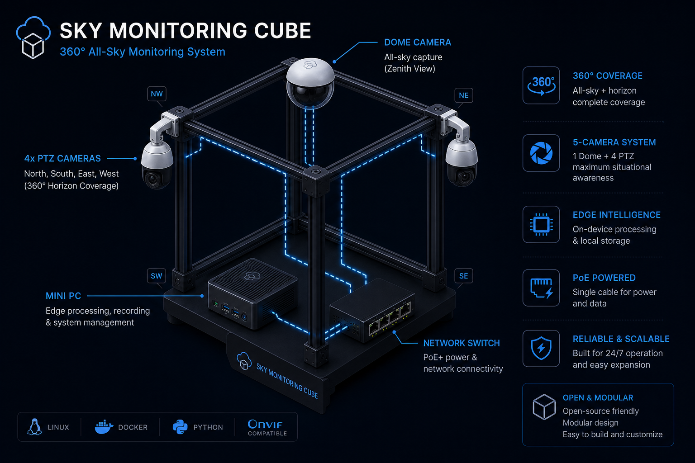
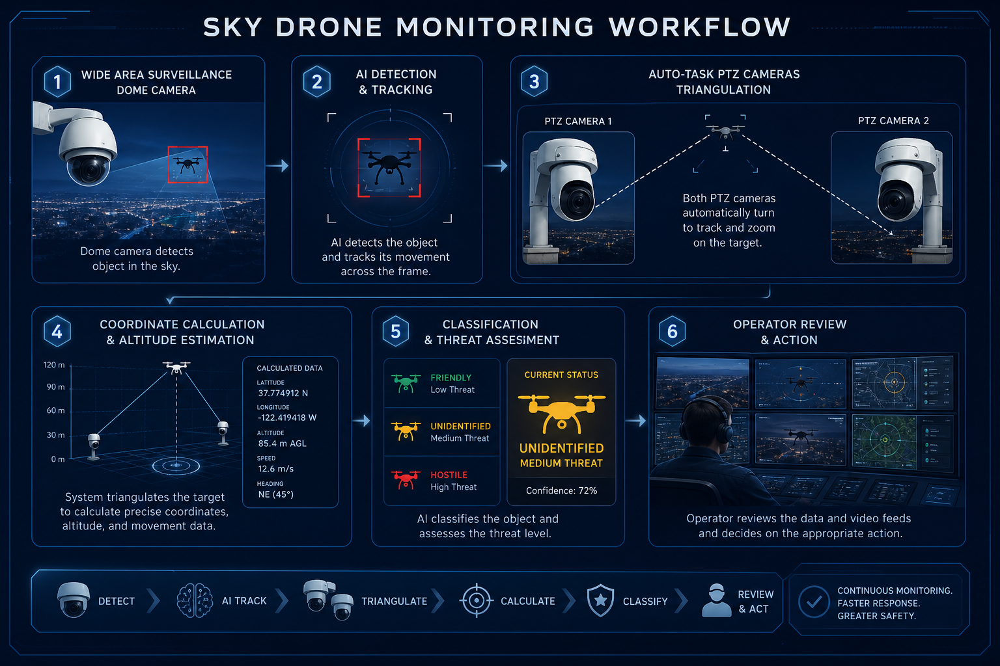
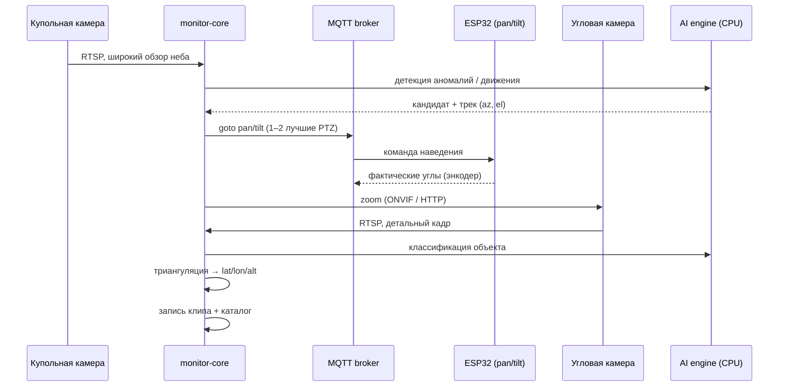
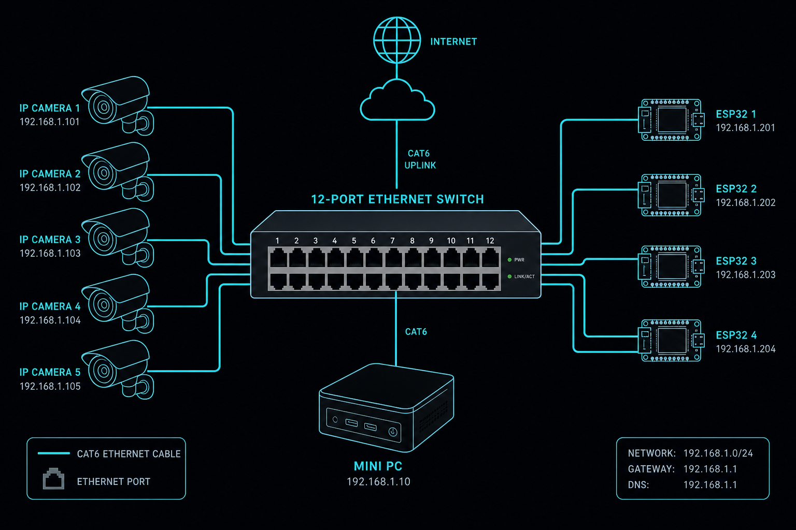
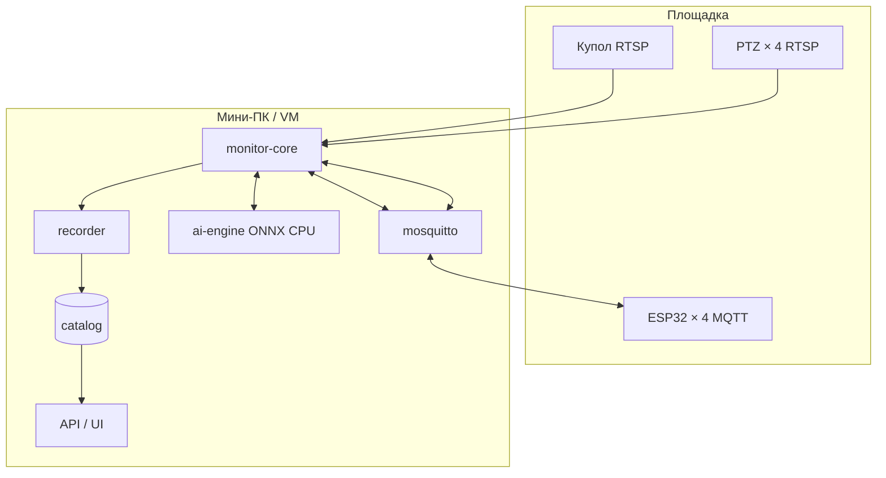

# Dron Monitoring

<p align="center">
  
</p>

<p align="center">
  <strong>Автономный комплекс наблюдения за воздушным пространством</strong><br>
  Купольная камера ищет аномалии на небе → угловые PTZ наводятся и классифицируют объект → координаты, высота, запись для оператора.
</p>

<p align="center">
  
  
  
  
</p>

---

## Содержание

- [Назначение](#назначение)
- [Как это работает](#как-это-работает)
- [Аппаратная компоновка](#аппаратная-компоновка)
- [Сеть и питание](#сеть-и-питание)
- [Программная архитектура](#программная-архитектура)
- [Структура репозитория](#структура-репозитория)
- [Быстрый старт](#быстрый-старт)
- [Документация](#документация)
- [Roadmap](#roadmap)

---

## Назначение

Комплекс предназначен для **обнаружения и сопровождения** летящих объектов на небе:

| Класс объекта | Примеры |
|---------------|---------|
| БПЛА | дроны, квадрокоптеры |
| Авиация | самолёты, вертолёты |
| Другое | ракеты, неопознанные цели |

**Не в scope:** поиск открытых IP-камер в интернете. Используются **собственные** камеры комплекса.

---

## Как это работает

<p align="center">
  
</p>



### Этапы

1. **Поиск** — купольная fisheye-камера непрерывно смотрит в небо.
2. **Трекинг** — ядро ведёт объект, переводит пиксели в азимут/угол места.
3. **Наведение** — до двух угловых модулей (лучший сектор N/E/S/W) поворачиваются по MQTT.
4. **Классификация** — нейросеть на CPU анализирует зум-поток.
5. **Геолокация** — две PTZ + калибровка площадки → дальность, высота, координаты.
6. **Архив** — клипы и скриншоты для оценки оператором.

---

## Аппаратная компоновка

### Вид сверху

```text
                 N (PTZ North)
                 │
    W (PTZ West)─┼─ E (PTZ East)
                 │
                 S (PTZ South)

         ●  купольная камера (центр, выше плоскости PTZ)
    PTZ1 ───────── PTZ2     ← 4 PTZ в одной горизонтальной плоскости
    PTZ3 ───────── PTZ4
```

### Угловой модуль

| Компонент | Назначение |
|-----------|------------|
| IP-камера | RTSP-поток, **зум** через ONVIF/HTTP |
| ESP32 + Ethernet | **pan/tilt** — 2 шаговых двигателя, энкодеры, MQTT |
| Платформа | Поворот и наклон камеры |

Зум управляется **камерой**, поворот/наклон — **ESP32**. Модули сменные и ориентированы на стороны света.

### Приводы

| Ось | Рекомендация |
|-----|--------------|
| Pan (поворот) | Шаговый двигатель + червячный редуктор + энкодер AS5600 |
| Tilt (наклон) | Шаговый или мощное серво + энкодер |
| Обратная связь | Home (концевик) + энкодер → фактический угол в MQTT |

---

## Сеть и питание

<p align="center">
  
</p>

| Устройство | Кол-во | Порт switch |
|------------|--------|-------------|
| Купольная камера | 1 | 1 |
| Угловые камеры | 4 | 2–5 |
| ESP32 контроллеры | 4 | 6–9 |
| Мини-ПК (ядро) | 1 | 10 |
| Резерв / интернет | — | 11–12 |

- **Switch:** 12 портов, **без PoE** — только Ethernet.
- **Питание:** отдельная разводка (камеры, ESP32, моторы 12 V, мини-ПК).
- **Подсеть:** выделенная LAN, статические IP (пример `192.168.10.0/24`).
- **Интернет:** опционально через uplink; комплекс работает автономно.

Подробнее: [docs/architecture.md](docs/architecture.md)

---

## Программная архитектура



| Сервис | Роль |
|--------|------|
| **monitor-core** | ingest, трекинг, оркестратор PTZ, geolocate, API |
| **mosquitto** | MQTT: команды pan/tilt ↔ ESP32 |
| **ai-engine** | детекция (купол) + классификация (PTZ), CPU/ONNX |
| **recorder** | клипы и скриншоты по событиям |
| **catalog** | треки, координаты, классификации, обзор оператором |

### MQTT (пример)

```json
// ptz/north/cmd
{ "cmd": "goto", "pan_deg": 12.0, "tilt_deg": 38.5, "speed": 0.7 }

// ptz/north/state
{ "pan_deg": 11.8, "tilt_deg": 38.4, "moving": false, "homed": true }
```

---

## Структура репозитория

```text
Dron_monitoring/
├── core/                 # ядро: ingest, tracker, orchestrator, geolocate, api
├── services/
│   └── ai/               # ONNX inference (CPU)
├── firmware/
│   └── ptz-controller/   # ESP32: шаговики, энкодеры, MQTT
├── config/               # cameras.yaml, site.yaml, calibration
├── docs/
│   ├── architecture.md
│   └── images/
├── docker-compose.yml
└── README.md
```

---

## Быстрый старт

> Проект в стадии проектирования. Каркас сервисов добавляется по мере разработки.

```bash
git clone https://github.com/Andry495/Dron_monitoring.git
cd Dron_monitoring

# когда появится compose:
cp config/.env.example .env
docker compose up -d
```

**Среда разработки:** виртуальная машина.  
**Боевой узел:** мини-ПК в составе комплекса на площадке.

---

## Документация

| Документ | Описание |
|----------|----------|
| [docs/architecture.md](docs/architecture.md) | Полная архитектура, геолокация, выбор камер |
| [config/](config/) | Примеры конфигурации |

---

## Roadmap

- [ ] Каркас `monitor-core` + Docker Compose
- [ ] MQTT-контракт и прошивка ESP32 (pan/tilt + энкодер)
- [ ] Ingest RTSP + кольцевой буфер
- [ ] Трекер + оркестратор (выбор 1–2 PTZ)
- [ ] Модуль `geolocate` (триангуляция)
- [ ] AI-engine: детекция + классификация (ONNX CPU)
- [ ] Recorder + каталог + UI оператора
- [ ] Интеграция с реальным железом на кубе

---

## Лицензия

Уточняется.

## Автор

[Andry495](https://github.com/Andry495)
