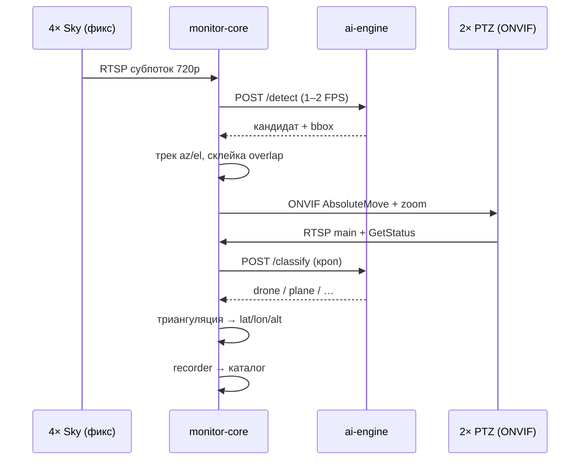
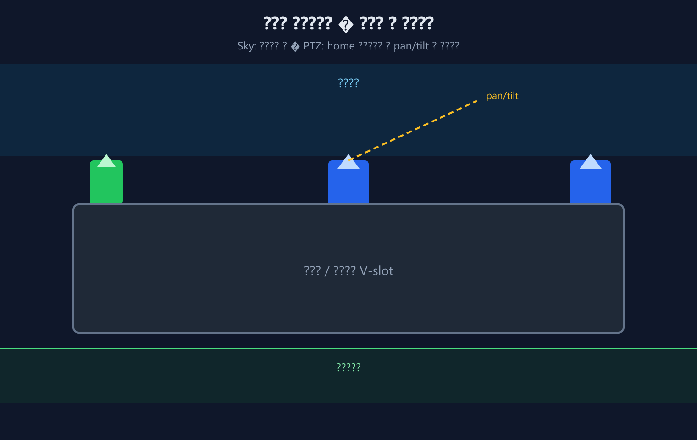
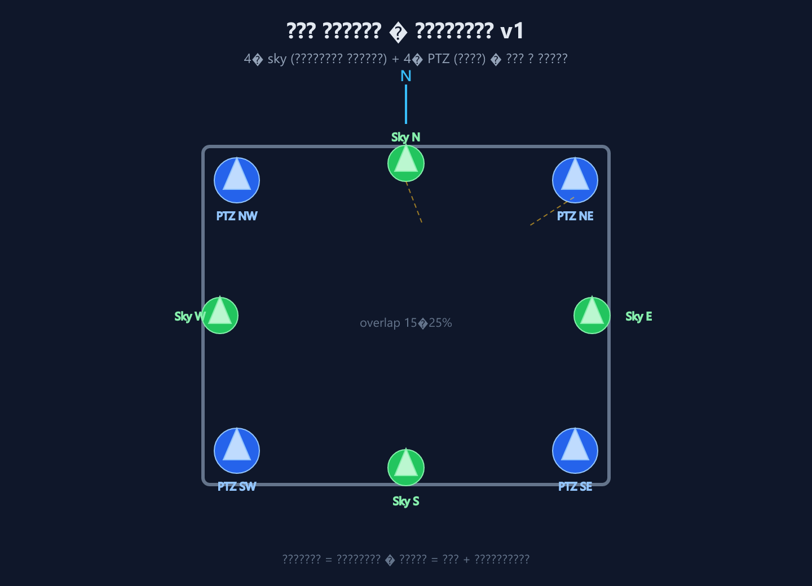
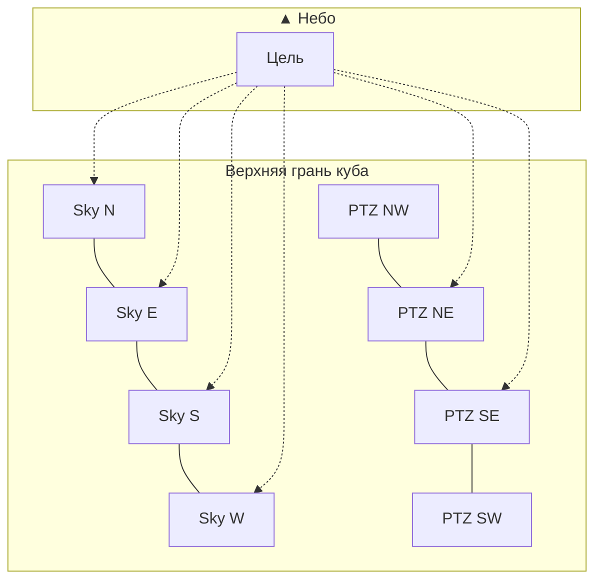
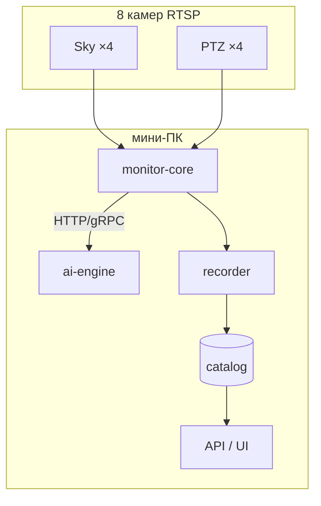

# Dron Monitoring

<p align="center">
  
</p>

<p align="center">
  <strong>Автономный комплекс наблюдения за воздушным пространством</strong><br>
  4 камеры неба фиксируют движение → 2 PTZ наводятся и классифицируют → координаты, высота, запись для оператора.
</p>

<p align="center">
  
  
  
  
</p>

---

## Комплект v1 (рекомендуемый)

| Слой | Модель × кол-во | Роль |
|------|-----------------|------|
| **Небо** | Hikvision **DS-2CD2T47G2-L(2.8mm)** × 4 | Движение, грубый az/el |
| **Углы** | Hikvision **DS-2DE4A425IWG-E** × 4 | Наведение, зум 25×, форма, координаты |
| **Вычисления** | мини-ПК: **monitor-core** + **ai-engine** | Управление отдельно от NN |
| **Сеть** | Switch **12p**, без PoE | 9 портов занято |

**Ориентировочная стоимость камер:** ~**252 000 ₽**

---

## Содержание

- [Назначение](#назначение)
- [Как это работает](#как-это-работает)
- [Аппаратная компоновка](#аппаратная-компоновка)
- [Сеть и питание](#сеть-и-питание)
- [Программная архитектура](#программная-архитектура)
- [Структура репозитория](#структура-репозитория)
- [Быстрый старт](#быстрый-старт)
- [Документация](#документация)
- [Roadmap](#roadmap)

---

## Назначение

Обнаружение и сопровождение объектов на небе: дроны, самолёты, вертолёты, ракеты.

| Камера | Задача |
|--------|--------|
| **4× Sky** | Только **факт движения** + направление |
| **4× PTZ** | **Наведение**, зум, **форма**, **координаты** (триангуляция 2 шт.) |

---

## Как это работает

<p align="center">
  
</p>



### Этапы

1. **4× Sky** — непрерывный обзор секторов N/E/S/W с перекрытием 15–25%.
2. **ai-engine** `/detect` — движение / лёгкий детектор (отдельный сервис).
3. **core** — трекинг, склейка треков на overlap, выбор 1–2 PTZ.
4. **PTZ** — ONVIF pan/tilt/zoom, классификация через **ai-engine** `/classify`.
5. **geolocate** — 2 PTZ + калибровка → дальность, высота, координаты.
6. **recorder** — клипы для оператора.

---

## Аппаратная компоновка

Камеры на **верхней грани** куба, ось **▲ вверх** (зенит). Sky — середины сторон; PTZ — углы.

<p align="center">
  
</p>

<p align="center">
  
</p>



| Параметр | Sky × 4 | PTZ × 4 |
|----------|---------|---------|
| Модель | DS-2CD2T47G2-L | DS-2DE4A425IWG-E |
| Монтаж | Середина стороны N/E/S/W | Углы куба |
| Home | ▲ вверх + наклон к сектору | ▲ вверх |
| Управление | Только RTSP | ONVIF pan/tilt/zoom |
| Зум | Фикс 2.8 mm | 25× optical |

> **ESP32 и DIY-приводы в v1 не используются.** См. [docs/alternatives.md](docs/alternatives.md).

---

## Сеть и питание

<p align="center">
  
</p>

| # | Устройство | IP (пример) |
|---|------------|-------------|
| — | мини-ПК | 192.168.10.10 |
| 1–4 | Sky N/E/S/W | .11 – .14 |
| 5–8 | PTZ NE/SE/SW/NW | .21 – .24 |
| 9–10 | Резерв / uplink | — |

- Switch **12p**, без PoE; питание камер — отдельная разводка 12 V.
- Подсеть `192.168.10.0/24`, статические IP.
- Интернет опционален; комплекс автономен.

---

## Программная архитектура



| Сервис | Нагрузка | Роль |
|--------|----------|------|
| **monitor-core** | Лёгкая | RTSP, трекинг, ONVIF, geolocate, API |
| **ai-engine** | NN (CPU) | `/detect` sky, `/classify` PTZ |
| **recorder** | Диск I/O | Клипы по событиям |

**Принцип:** нейросеть **не** в процессе core — отдельный контейнер, можно масштабировать / обновлять модели без простоя управления.

---

## Структура репозитория

```text
Dron_monitoring/
├── core/              # ingest, sky_watch, tracker, orchestrator, onvif, geolocate, api
├── services/ai/       # ai-engine: ONNX, /detect, /classify
├── config/            # site.yaml, calibration
├── docs/              # architecture, cameras, optics
├── docker-compose.yml
└── README.md
```

---

## Быстрый старт

```bash
git clone https://github.com/Andry495/Dron_monitoring.git
cd Dron_monitoring
cp config/.env.example .env
cp config/site.example.yaml config/site.yaml
# заполнить пароли ONVIF и координаты площадки
docker compose up -d
```

**Разработка:** VM · **Бой:** мини-ПК на площадке.

---

## Документация

| Документ | Описание |
|----------|----------|
| [docs/architecture.md](docs/architecture.md) | Архитектура v1 |
| [docs/cameras.md](docs/cameras.md) | BOM и цены |
| [docs/camera-comparison.md](docs/camera-comparison.md) | Сравнение моделей камер |
| [docs/infrastructure-comparison.md](docs/infrastructure-comparison.md) | ПК, switch, ai-engine CPU/GPU |
| [docs/optics-and-range.md](docs/optics-and-range.md) | Дальности обнаружения |
| [docs/alternatives.md](docs/alternatives.md) | Отложенные варианты (fisheye, DIY, ESP32) |
| [docs/dead-zones.md](docs/dead-zones.md) | Мёртвые зоны Sky + PTZ |
| [docs/turret.md](docs/turret.md) | Турель: пневмосеть, наведение до 50 m |
| [docs/turret-ballistics.md](docs/turret-ballistics.md) | Баллистика и упреждение |
| [config/site.example.yaml](config/site.example.yaml) | Конфиг площадки |
| [config/turret.example.yaml](config/turret.example.yaml) | Конфиг турели |

---

## Roadmap

- [x] Docker Compose: core + ai-engine
- [ ] Ingest 4× sky + 4× PTZ RTSP
- [ ] sky_watch: overlap merge, az/el
- [ ] ONVIF orchestrator (2 PTZ primary/secondary)
- [ ] ai-engine: /detect, /classify (ONNX CPU)
- [ ] geolocate: триангуляция + zoom FOV table
- [ ] recorder + каталог + UI оператора
- [ ] Калибровка на стенде (1 PTZ + 4 sky)
- [ ] Карта мёртвых зон: облёт / симуляция → `data/calibration/dead_zones_*.json`
- [ ] **Турель (опц.):** turret-controller, полигон, баллистика сети

---

## Лицензия

Уточняется.

## Автор

[Andry495](https://github.com/Andry495)
