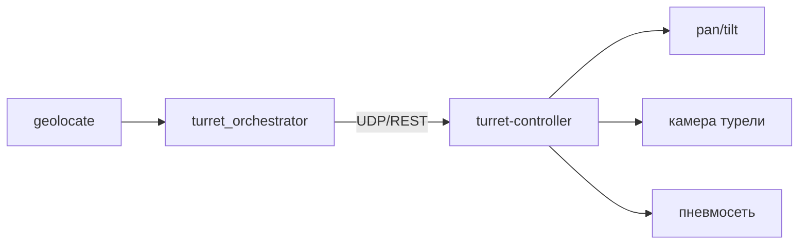

# Архитектура Dron Monitoring — v1

Версия: **1.0**  
Дата: 2026-07-08  
Статус: **рекомендуемый комплект**

---

## 1. Решение v1

| Компонент | Выбор |
|-----------|--------|
| Обзор неба | **4× фикс** Hikvision DS-2CD2T47G2-L(2.8mm), overlap 15–25% |
| Угловые камеры | **4× готовая PTZ** Hikvision DS-2DE4A425IWG-E (25× optical) |
| Управление PTZ | **ONVIF** (pan/tilt/zoom), без ESP32 |
| Нейросеть | **ai-engine** — отдельный сервис, core не грузится inference |
| Вычислитель | мини-ПК (CPU-only), VM для разработки |
| Сеть | Switch 12p, без PoE, 9 портов занято |

**Не в v1:** fisheye-купол, DIY-шаговики, MQTT, ESP32.

---

## 2. Физическая компоновка

Один и тот же комплект **4× sky + 4× PTZ** монтируется двумя способами (`deployment.type` в `site.yaml`):

| Вариант | `deployment.type` | Где камеры | Где мини-ПК | Конфиг |
|---------|-------------------|------------|-------------|--------|
| **Стационар на здании** | `building_corners` | Углы крыши | **Купол-hub** по центру (без камер) | `site.building.example.yaml` |
| **Компактный куб** | `cube_compact` | Верхняя грань 1×1 m | В кубе или рядом | `site.example.yaml` |

Подробно про стационар: [deployment-building.md](deployment-building.md).

### 2.1 building_corners (рекомендуется для здания)

```text
              N
    [Sky+PTZ]────────────[Sky+PTZ]
         │    ( купол )      │
         │     hub PC        │
    [Sky+PTZ]────────────[Sky+PTZ]
```

- ENU origin = центр купола на крыше.
- База PTZ **10–40 m** → лучше триангуляция.
- Схема: [building-top-view.png](images/building-top-view.png)

### 2.2 cube_compact (переносной пост)

```text
              N
    [PTZ-NW]──[Sky-N]──[PTZ-NE]
         │               │
    [Sky-W]     куб     [Sky-E]
         │               │
    [PTZ-SW]──[Sky-S]──[PTZ-SE]
```

| Камера | Позиция | Home | Задача |
|--------|---------|------|--------|
| Sky N/E/S/W | Середина стороны верхней грани | ▲ + наклон к сектору | Движение |
| PTZ × 4 | Углы верхней грани | ▲ зенит | Наведение, зум, геометрия |

- Схемы: [cube-top-view.png](images/cube-top-view.png) · [cube-side-view.png](images/cube-side-view.png)

Ориентация по сторонам света. GPS площадки + калибровка → WGS84.

### Схемы (общие)

> Иллюстрации PNG — только по [diagram-generation.md](diagram-generation.md): AI `_base` + Pillow кириллица.

| Файл | Содержание |
|------|------------|
| [building-top-view.png](images/building-top-view.png) | building_corners: углы + купол |
| [cube-top-view.png](images/cube-top-view.png) | cube_compact: 4 sky + 4 PTZ |
| [cube-side-view.png](images/cube-side-view.png) | cube_compact: вид сбоку |
| [system-overview.png](images/system-overview.png) | Обзор комплекса |
| [software-stack.png](images/software-stack.png) | Программный стек и модули core |
| [operator-console.png](images/operator-console.png) | Консоль оператора и симуляция |
| [detection-flow.png](images/detection-flow.png) | Поток данных |
| [network-topology.png](images/network-topology.png) | Сеть |
| [dead-zones-top.png](images/dead-zones-top.png) | Мёртвые зоны: азимут |
| [dead-zones-elevation.png](images/dead-zones-elevation.png) | Мёртвые зоны: угол места |
| [dead-zones-layers.png](images/dead-zones-layers.png) | Слои покрытия M/C/G/T |

---

## 3. Сеть и питание

| IP | Устройство |
|----|------------|
| .10 | мини-ПК (core, ai-engine, recorder) |
| .11 | Sky North |
| .12 | Sky East |
| .13 | Sky South |
| .14 | Sky West |
| .21 | PTZ NE |
| .22 | PTZ SE |
| .23 | PTZ SW |
| .24 | PTZ NW |

Питание: 12 V разводка на камеры; мини-ПК — 220 V. PoE не используется.

---

## 4. Поток данных

```mermaid
flowchart LR
    subgraph Ingest
        S1[Sky N] & S2[Sky E] & S3[Sky S] & S4[Sky W]
    end
    subgraph Core
        SW[sky_watch]
        TR[tracker]
        OR[orchestrator]
        GL[geolocate]
        RC[recorder]
    end
    subgraph AI
        DET[/detect]
        CLS[/classify]
    end
    subgraph PTZ
        P1[PTZ A] & P2[PTZ B]
    end

    S1 & S2 & S3 & S4 --> SW
    SW -->|HTTP| DET
    DET --> SW
    SW --> TR --> OR
    OR -->|ONVIF| P1 & P2
    P1 & P2 -->|RTSP| OR
    OR -->|HTTP| CLS
    OR --> GL --> RC
```

1. **sky_watch** — 4 RTSP субпотока, 1–2 FPS в ai-engine.
2. **tracker** — az/el, склейка на overlap между соседними sky.
3. **orchestrator** — выбор primary + secondary PTZ (до 2).
4. **ONVIF** — `AbsoluteMove` + `zoom`; `GetStatus` → углы.
5. **ai-engine** `/classify` — кроп с PTZ после зума.
6. **geolocate** — 2 луча → lat/lon/alt/range.
7. **recorder** — sky + PTZ primary по событию.

---

## 5. ai-engine (отдельный сервис)

| Endpoint | Вход | Выход | Частота |
|----------|------|-------|---------|
| `POST /v1/detect` | кадр 720p sky | bbox[], score | 1–2 FPS × 4 потока |
| `POST /v1/classify` | кроп PTZ | class, confidence | по событию |
| `GET /v1/health` | — | ok | — |

- Runtime: ONNX Runtime, CPU EP, INT8 модели.
- Очередь с дропом старых кадров на sky при перегрузке.
- core общается по HTTP (localhost или docker network).

---

## 6. Геолокация

### Источники углов (v1)

| Источник | Роль |
|----------|------|
| Sky × 4 | Обнаружение, грубый az/el (±1–3°) |
| ONVIF GetStatus | pan/tilt/zoom PTZ после калибровки |
| bbox + zoom FOV table | δaz, δel |

### Калибровка PTZ (обязательно)

1. Home = зенит, привязка `base_az` к северу.
2. Таблица optical zoom → HFOV/VFOV.
3. Стенд: повторяемость `GetStatus` после `goto`.
4. Замер при стабильном наведении, без цифрового зума.

### Триангуляция

2 PTZ → пересечение лучей в ENU → WGS84.  
Поля: `pos_confidence`, `triangulation_cameras`.

---

## 7. BOM (полный комплект v1)

### Камеры

| Позиция | Модель | Qty | ~₽ |
|---------|--------|-----|-----|
| Sky | DS-2CD2T47G2-L(2.8mm) | 4 | 44k |
| PTZ | DS-2DE4A425IWG-E | 4 | 208k |
| **Камеры итого** | | **8** | **~252k** |

### Инфраструктура

| Позиция | Спецификация | Qty | Примечание |
|---------|--------------|-----|------------|
| Switch | 12p Gigabit, **без PoE** | 1 | см. [infrastructure-comparison.md](infrastructure-comparison.md) |
| мини-ПК | i5-12600H, **16 GB RAM**, SSD 512 GB | 1 | CPU-only ai-engine; ~50k ₽ |
| БП 12 V | 10–15 A, разводка на 8 камер | 1 | PTZ ~24 W каждая |
| Кабель | Cat5e/Cat6 outdoor | 8× | До switch |
| Кронштейны | V-slot / 3D-печать / кровельные | 8 | Зависит от варианта |
| Куб / рама | V-slot 20×20, ~1 m³ | 0–1 | **cube_compact** — да; **building_corners** — нет |
| Купол-hub | IP54, мини-ПК + switch | 0–1 | **building_corners** — да; камеры не вешать |
| ИБП (опц.) | На мини-ПК + switch | 1 | Автономность при сбое 220 V |

### ПО (на мини-ПК)

| Сервис | Контейнер | Роль |
|--------|-----------|------|
| monitor-core | `dron-monitoring-core` | RTSP, ONVIF, geolocate, API |
| ai-engine | `dron-monitoring-ai` | ONNX `/detect`, `/classify` |

Подробно: [cameras.md](cameras.md) · [optics-and-range.md](optics-and-range.md) · [infrastructure-comparison.md](infrastructure-comparison.md)

---

## 8. Развёртывание

```bash
cp config/.env.example .env
# стационар на здании:
cp config/site.building.example.yaml config/site.yaml
# или переносной куб:
# cp config/site.example.yaml config/site.yaml
docker compose up -d
```

Состав `docker-compose.yml`:

| Сервис | Порт | Описание |
|--------|------|----------|
| `monitor-core` | 8080 | ingest, ONVIF, geolocate, API |
| `ai-engine` | 8090 | ONNX inference |

VM — разработка с записанными RTSP; мини-ПК — бой.

---

## 10. Модуль перехвата (турель) — опционально

**Не входит в v1 наблюдения.** Проектируется как исполнительное устройство:

| Параметр | Значение |
|----------|----------|
| Тип | Пневматическая турель с сетью |
| R_max | 50 m |
| Наведение | Грубо от core → точно камерой турели |
| Упреждение | По `velocity_enu` + баллистика сети |
| IP | .30/.31 turret-01, .32/.33 turret-02 (опц.) |



Документация: [turret.md](turret.md) · [turret-ballistics.md](turret-ballistics.md)

---

## 11. Связанные документы

- [README.md](../README.md)
- [cameras.md](cameras.md)
- [optics-and-range.md](optics-and-range.md)
- [alternatives.md](alternatives.md) — fisheye, DIY, ESP32 (не v1)
- [deployment-building.md](deployment-building.md) — стационар: углы здания + купол-hub
- [turret.md](turret.md) — турель (опционально)
- [dead-zones.md](dead-zones.md) — мёртвые зоны (cube_compact; building — см. deployment-building)
