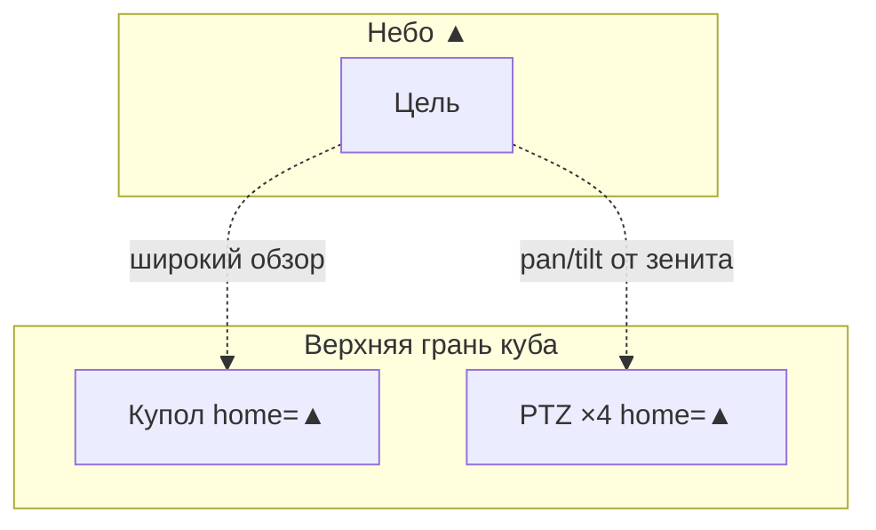

# Архитектура Dron Monitoring

Версия документа: 0.4  
Дата: 2026-07-08

## 1. Обзор

Автономный комплекс на базе кубической установки:

- **1 купольная камера** на верхней грани куба — ось **вверх**, постоянный обзор неба.
- **4 угловых модуля** в той же плоскости — home **вверх**, pan/tilt отклоняют к цели, зум для детализации.
- **Мини-ПК** — вычислительное ядро, нейросеть на CPU, запись, каталог.
- **4× ESP32 (Ethernet)** — управление pan/tilt шаговыми двигателями, обратная связь по углу.

Куб ориентирован по сторонам света: модули N / E / S / W. При известных GPS-координатах площадки вычисляются **азимут, дальность, высота и координаты** цели.

## 2. Физическая схема

### Ориентация монтажа

Все камеры устанавливаются **на верхней грани** куба. В положении **home** оптическая ось направлена **вверх** — к зениту и небу. Угловые PTZ отклоняются pan/tilt от вертикали к конкретной цели.

| Камера | Плоскость крепления | Home | Рабочий режим |
|--------|---------------------|------|----------------|
| Купольная | Центр верхней грани | Ось **▲ вверх** | Широкий обзор неба |
| PTZ × 4 | Углы верхней грани | Ось **▲ вверх** (N/E/S/W) | Pan/tilt к цели, зум |

> **Важно:** камеры **не** смотрят вниз. Направление «вниз» было ошибкой в ранних иллюстрациях — актуальные схемы в `docs/images/`.

### Схемы

| Схема | Файл |
|-------|------|
| Вид сбоку (▲ вверх) | [cube-side-view.svg](images/cube-side-view.svg) |
| Вид сверху (N/E/S/W) | [cube-top-view.svg](images/cube-top-view.svg) |
| Обзор комплекса | [system-overview.svg](images/system-overview.svg) |
| Сеть | [network-topology.svg](images/network-topology.svg) |



### Вид сбоку (текст)

```text
           ↑ небо / зенит
      [▲]    [▲]    [▲]         камеры НА верхней грани, смотрят ВВЕРХ
      ═══════════════════       верхняя грань куба
           ║  куб  ║
      ───────────────────       площадка

      ··· pan/tilt ↗ к цели у горизонта
```

### Вид сверху (текст)

```text
              N
              │
      W ──────┼────── E
              │
              S

      [▲] купол (центр)
      [▲] PTZ по углам — одна плоскость крепления
```

### Угловой модуль

| Часть | Функция |
|-------|---------|
| IP-камера | RTSP, моторизованный зум (ONVIF/HTTP) |
| ESP32 + ETH | 2 шаговика (pan/tilt), драйверы TMC2209, энкодеры |
| Механика | Червяк на pan (удержание ветра), home + AS5600 |

Зум **не** на ESP32 — только штатный интерфейс камеры.

## 3. Сеть

Switch **12 портов, без PoE**:

| # | Устройство | IP (пример) |
|---|------------|-------------|
| 1 | Купольная камера | 192.168.10.11 |
| 2–5 | Угловые камеры | .12 – .15 |
| 6–9 | ESP32 | .22 – .25 |
| 10 | Мини-ПК | .10 |
| 11–12 | Резерв / uplink | — |

Питание отдельно: камеры, ESP32 (5 V), моторы (12 V), мини-ПК (220 V).

## 4. Поток данных

1. Купол → детекция (лёгкая NN или motion + NN на ROI).
2. Трек → `(az, el)` в локальной системе (север = 0°).
3. Оркестратор выбирает **primary** и **secondary** PTZ (до 2 одновременно).
4. MQTT `goto` на ESP32; зум — на IP камеры.
5. Две PTZ с известными углами → триангуляция → `lat, lon, altitude, range`.
6. Классификация на зум-потоке: drone / plane / helicopter / rocket / unknown.
7. Запись клипа (купол + primary PTZ) в каталог.

## 5. Геолокация

### Системы координат

- **WGS84** — `lat₀, lon₀, h₀` точки установки (`site.yaml`).
- **ENU** — East, North, Up относительно площадки.
- **Углы** — азимут от севера, угол места от горизонта.

### Источники углов

| Источник | Точность |
|----------|----------|
| Купол | Обнаружение, грубый трек |
| ESP32 + энкодер | Фактические pan/tilt модуля |
| Камера + зум-калибровка | Поправка bbox → δaz, δel |

### Триангуляция

Два луча из позиций PTZ A и B → пересечение в ENU → WGS84.

Поля каталога: `az`, `el`, `range_m`, `altitude_m`, `lat`, `lon`, `pos_confidence`, `triangulation_cameras`.

## 6. MQTT

| Топик | Направление |
|-------|-------------|
| `ptz/{id}/cmd` | core → ESP32 |
| `ptz/{id}/state` | ESP32 → core |
| `ptz/{id}/status` | диагностика, online |

## 7. AI (CPU-only)

| Задача | Частота | Модель |
|--------|---------|--------|
| Детекция на куполе | 1–2 FPS | YOLO-nano / motion+NN, INT8 ONNX |
| Трекинг | каждый кадр | ByteTrack + Kalman (без NN) |
| Классификация PTZ | по событию | лёгкий классификатор на кропе |

Runtime: ONNX Runtime, CPU EP.

## 8. Выбор камер (ориентиры)

### Купол

- Fisheye 6–8 MP, outdoor IP67, RTSP.
- Субпоток 720p/1080p для детектора.

### Углы — готовая PTZ

- 4 MP, ~25× optical zoom, IP66+, ONVIF absolute PTZ.
- Линии: Hikvision DS-2DE4A425*, Dahua SD49425* (или аналоги).

### Углы — DIY

- Bullet outdoor с моторизованным зумом (IZ), без встроенного PTZ.
- Линии: Hikvision DS-2CD*-*IZS, Dahua IPC-HFW*-Z*E.

## 9. Развёртывание

| Среда | Назначение |
|-------|------------|
| VM | Разработка, тесты с записанными RTSP |
| Мини-ПК на площадке | Боевой узел, автономная работа |

Один `docker-compose.yml` для обеих сред; отличия в `.env`.

## 10. Связанные документы

- [README.md](../README.md) — обзор проекта
- `config/` — примеры конфигурации (по мере добавления)
