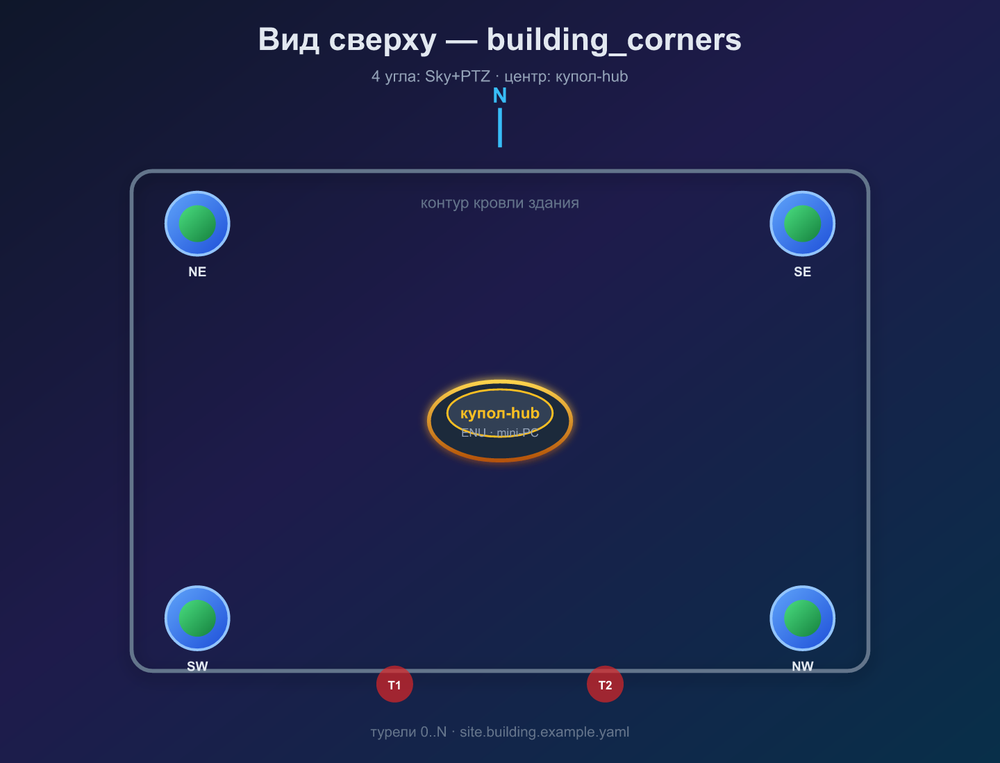

# Стационарная компоновка: здание + центральный купол

Версия: **0.1**  
Статус: **рекомендуемый простой вариант** для неподвижного объекта

---

## 1. Идея

Вместо компактного **куба** с камерами на верхней грани:

| Узел | Где | Роль |
|------|-----|------|
| **8 камер** | Углы здания (4× sky + 4× PTZ) | Обзор и наведение |
| **Купол по центру** | Крыша / двор, центр контура | Мини-ПК, switch, UPS — **без камер** |

```text
              N
              │
    [Sky+PTZ]────────────[Sky+PTZ]     ← северо-восточный и северо-западный углы
         │                      │
         │      ( купол )       │       ← monitor-core + ai-engine
         │       hub            │
         │                      │
    [Sky+PTZ]────────────[Sky+PTZ]
              │
              S

  ENU origin — проекция центра купола на плоскость крыши
```



ПО и протоколы **те же**, что у куба: RTSP sky, ONVIF PTZ, тот же `monitor-core`.

---

## 2. Сравнение с кубом

| | **Куб (cube_compact)** | **Здание (building_corners)** |
|---|------------------------|-------------------------------|
| Мобильность | Переносной постамент | Стационар на объекте |
| Монтаж камер | Верхняя грань 1×1 m | Углы крыши/фасада |
| База PTZ | ~0.7 m (диагональ куба) | **10–40 m** (диагональ здания) |
| Геолокация | Хуже на малых R | **Лучше** — длинная база |
| Зонтик куба S2 | Зонтик купола S2 (~1–2 m) |
| Кабель | Короткий | Разводка по крыше к углам |
| Конфиг | `config/site.example.yaml` | `config/site.building.example.yaml` |

---

## 3. Монтаж камер на углах

### 3.1 Типовая схема (4 угла × 2 камеры)

На каждом углу здания:

1. **Sky (фикс)** — широкий сектор наружу + наклон вверх (`mount_tilt_deg` 25–35°).
2. **PTZ** — на той же мачте или на 0.3–0.5 m выше; home **в зенит** или на bisector угла (`base_az_deg` 45°, 135°, …).

| Угол | `sector_az_deg` / `base_az_deg` | `offset_en_m` (пример 30×24 m) |
|------|----------------------------------|--------------------------------|
| NE | 45° | `[+15, +12, h]` |
| SE | 135° | `[+15, -12, h]` |
| SW | 225° | `[-15, -12, h]` |
| NW | 315° | `[-15, +12, h]` |

`h` — высота монтажа над origin (куполом), м. Снять рулеткой + GPS углов.

### 3.2 Альтернатива: sky на серединах стен

Если на углу не помещаются две камеры — PTZ остаются на углах, sky переносят на **середины** сторон N/E/S/W (как на кубе, но с большими `offset_en_m`). Конфиг правится вручную.

---

## 4. Центральный купол (hub)

**Не путать** с fisheye-«рыбьим глазом» из [alternatives.md](alternatives.md).

| Содержимое | Назначение |
|------------|------------|
| Мини-ПК | monitor-core, ai-engine, recorder |
| Switch 12p | `192.168.10.0/24` |
| UPS (опц.) | Питание при кратком отключении |
| Кожух IP54 | Солнце, дождь |

Камеры на купол **не ставим** — он только вычислительный узел. Origin координат = **центр купола**.

Питание камер: отдельная разводка 12 V по крыше к углам; длина кабеля учитывать при падении напряжения.

---

## 5. Калибровка и origin

1. Выбрать origin — центр купола на крыше (проекция на горизонталь).
2. GPS/WGS84 точки на **4 углах** + центр → `site.lat/lon`, проверка `orientation_deg`.
3. Заполнить `offset_en_m` для каждой камеры в `site.yaml` (см. [site.building.example.yaml](../config/site.building.example.yaml)).
4. PTZ: калибровка `zoom_curve` на стенде — как для куба.

Триангуляция в core v0.1 упрощена; при building layout **обязательно** передавать реальные `offset_en_m` — в следующих версиях geolocate будет учитывать положение PTZ, а не только луч из origin.

---

## 6. Турель и перехват

Турель по-прежнему **отдельный модуль** ([turret.md](turret.md)):

- может стоять во дворе у купола или сбоку от здания;
- привязка через `site_binding.site_id` и общий ENU origin (центр купола);
- `offset_enu_m` в `turret.yaml` — смещение постамента турели от origin.

---

## 7. Мёртвые зоны

Отличия от [dead-zones.md](dead-zones.md) (куб):

| Зона | Building layout |
|------|-----------------|
| S2 «зонтик» | Малый радиус над куплом (~1–2 m), не над всем зданием |
| S1 швы sky | Между углами — **больше overlap** за счёт дистанции; калибровать `overlap_deg` |
| Тень здания | Низкие цели за корпусом — **A** (только motion с дальних sky) |
| P5 зенит | Между 4 PTZ на углах — **лучше**, чем над кубом |

---

## 8. Быстрый старт

```bash
cp config/site.building.example.yaml config/site.yaml
# поправить half_width_m, half_depth_m, offset_en_m, lat/lon
cp config/.env.example .env
docker compose up -d
```

---

## 9. Когда выбирать

| Выбирайте **building_corners** | Выбирайте **cube_compact** |
|----------------------------------|----------------------------|
| Есть крыша / стационарное здание | Нужен переносной пост |
| Важна точная геолокация | Минимальный монтаж «из коробки» |
| Готовы тянуть кабель к углам | Один столб / куб 1×1 m |
