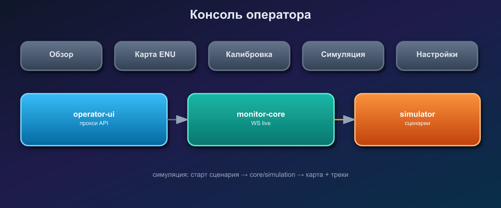

# Консоль оператора



Веб-интерфейс для управления площадкой: обзор треков, карта ENU, автокалибровка, симуляция.

## Компоненты

| Сервис | Порт | Назначение |
|--------|------|------------|
| `operator-ui` | 3000 | Статика `ui/` + прокси `/api` → core, `/sim` → simulator |
| `monitor-core` | 8080 | REST + WebSocket `/v1/ws/operator` |
| `scenario-simulator` | 8070 | Сценарии, ground truth, feed детекций |

## Запуск

```bash
docker compose --profile ui up -d
```

Открыть http://localhost:3000

Локально без Docker:

```bash
# терминал 1
cd services/simulator && scenario-simulator

# терминал 2
cd core && monitor-core

# терминал 3
cd services/operator-ui
set UI_DIR=../../ui
set CORE_URL=http://localhost:8080
set SIMULATOR_URL=http://localhost:8070
operator-ui
```

## Вкладки

- **Обзор** — треки, геолокация, счётчики (WebSocket).
- **Карта** — вид сверху: hub, камеры, турели, траектории и классификация объектов.
- **Калибровка** — мастера `sky_overlap`, `ptz_zoom`, `site_origin`, `turret_boresight`; отчёты в `data/calibration/`.
- **Симуляция** — старт/стоп сценария; переключение core `live` ↔ `simulation`.
- **Настройки** — layout площадки и список турелей.

## Режим simulation

1. Запустить `scenario-simulator`.
2. В UI: **Симуляция** → старт сценария (`drone_approach` или `multi_orbit`).
3. **Core → simulation** — core читает `GET /v1/feed/detections` вместо sky RTSP.
4. На карте отображаются `sim_objects` (ground truth) и треки pipeline.

Переменные окружения core: `PIPELINE_MODE=simulation`, `SIMULATOR_URL=http://scenario-simulator:8070`.

## API калибровки (core)

- `POST /v1/calibration/auto/start` — `{ "scope": "sky_overlap" }`
- `GET /v1/calibration/jobs/{job_id}` — статус шагов и рекомендации
- `GET /v1/site/layout` — геометрия для карты

Автоматические шаги выполняются в dry-run; финальная запись в `site.yaml` / `turret.yaml` — следующая итерация (ручное подтверждение в UI).
