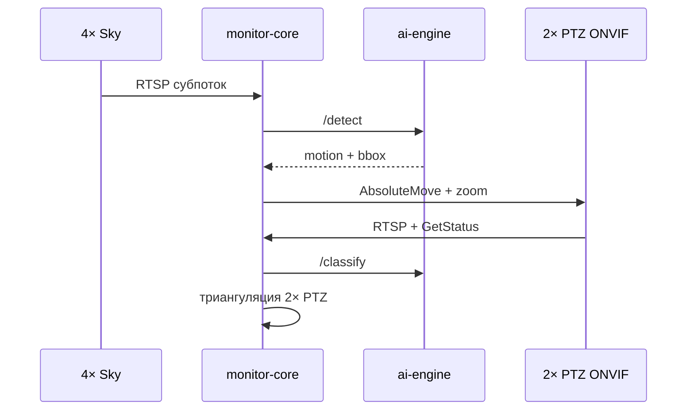

# Оптика и дальность обнаружения

Версия: **1.0** · 2026-07-08 · комплект **v1**

Цели: **0.3–8 m** (дрон ~30–50 cm … самолёт/вертолёт до ~8 m).  
Роли камер:
- **4× Sky (DS-2CD2T47G2-L)** — только факт движения + грубое `(az, el)`, overlap 15–25%.
- **4× PTZ (DS-2DE4A425IWG-E)** — ONVIF наведение, зум 25×, форма, **координаты**.

---

## 1. Базовые формулы

### Угловой размер цели

```
α [град] ≈ 57.3 × (D / R)

D — размер объекта (м), поперёк линии визирования
R — наклонная дальность до объекта (м)
```

### Размер в пикселях

```
N_px ≈ α × (W / HFOV)

W     — ширина кадра (px), напр. 2560
HFOV  — горизонтальный угол обзора (град)
```

### Минимум для задач

| Задача | N_px (ориентир) | Камера |
|--------|-----------------|--------|
| Движение / blob | **≥ 4–8** | 4× Sky |
| Детектор NN (sky) | **≥ 12–16** | 4× Sky → ai-engine |
| Класс формы (дрон/самолёт) | **≥ 32–64** | PTZ с зумом |
| Геометрия / угловой размер | **≥ 20** + калибровка zoom | PTZ |

---

## 2. Характеристики камер из подбора

### Небо — 4× фикс 2.8 mm (**v1**)

| Параметр | Значение |
|----------|----------|
| Модель | Hikvision DS-2CD2T47G2-L(2.8mm) |
| Разрешение | 2688 × 1520 (4 MP) |
| HFOV | ~105° |
| px/град | **~25.6** |
| Субпоток для NN | 1280 × 720 → ~12 px/град |

### Небо — fisheye (не v1, см. alternatives.md)

| Параметр | Значение |
|----------|----------|
| Модель | Dahua DH-IPC-EBW81242-AS-S2 |
| Разрешение | 4000 × 3000 (режим 1O) |
| FOV | 360° (вся сфера в одном кадре) |
| px/град у зенита | ~11 (неравномерно: у края хуже) |

### Угловая PTZ — Hikvision DS-2DE4A425IWG-E

| Zoom | HFOV | px/град (2560 px) |
|------|------|-------------------|
| 1× (wide) | 53.3° | 48 |
| ~10× | ~5° | 512 |
| 25× (tele) | 2.6° | **~985** |

Зум для геометрии — только **оптический** (по таблице FOV из datasheet / калибровки).

---

## 3. Дальность: только обнаружение движения (небо)

Критерий: **N_px ≥ 6** на основном потоке (движение + лёгкий детектор).

| Объект | D | R_max (движение) | α @ R_max |
|--------|---|------------------|-----------|
| Мини-дрон | 0.3 m | **~80 m** | 0.21° → 5 px |
| Квадрокоптер | 0.5 m | **~130 m** | 0.22° → 6 px |
| Крупный дрон | 1.0 m | **~260 m** | 0.22° |
| Вертолёт (корпус ~4 m) | 4 m | **~1000 m** | 0.23° |
| Самолёт (размах ~8 m) | 8 m | **~2000 m** | 0.23° |

При **субпотоке 720p** дальность детекции движения **примерно в 2 раза меньше**.

**Вывод:** небесные камеры — **раннее предупреждение** на сотнях метров (крупные цели) и **десятках–сотне м** для дронов. На километрах — только крупная авиация как точка движения.

### Дрон на высоте 10 m

Если горизонтальная дальность до куба **R = 50 m**, наклонная **√(50² + 10²) ≈ 51 m**:

| D | N_px (105° FOV) |
|---|-----------------|
| 0.3 m | ~8 → **движение видно** |
| 0.5 m | ~14 → **уверенно на небе** |

Если **R = 200 m**, наклонная ~200 m, D = 0.5 m → **~3 px** — на небе **нет**, нужна PTZ.

---

## 4. Дальность: классификация формы (PTZ + зум)

Критерий: **N_px ≥ 40** на основном потоке PTZ.

### При 25× zoom (HFOV 2.6°, ~985 px/град)

| Объект | D | R_max (классификация) |
|--------|---|----------------------|
| 0.3 m | мини-цель | **~350–450 m** |
| 0.5 m | дрон | **~550–700 m** |
| 1.0 m | крупный дрон | **~1.1 km** |
| 4 m | вертолёт | **~4.5 km** |
| 8 m | самолёт | **~9 km** (теор.; см. атмосферу) |

### При ~10× zoom (HFOV ~5°)

Дальность классификации **~в 2.5 раза меньше**, чем на 25×.

### Практический коридор для дронов (0.3–0.5 m)

| Режим | Дальность |
|-------|-----------|
| Небо: «что-то движется» | 80–130 m |
| PTZ: навестись | после события с неба |
| PTZ: различить форму | **300–700 m** (зависит от зума и контраста) |
| PTZ: стабильная геометрия | **150–500 m** (см. §6) |

---

## 5. Рабочая цепочка (как задумано)



| Этап | Камера | Результат |
|------|--------|-----------|
| 1 | Небо | `event: motion`, az/el ±1–3° |
| 2 | PTZ wide | захват цели в кадре |
| 3 | PTZ zoom | форма, класс, bbox |
| 4 | 2× PTZ | lat, lon, alt, range |

---

## 6. Триангуляция: углы с готовых PTZ

### Да, углы получить можно — с оговорками

Готовые **Hikvision DS-2DE4A425** / **Dahua SD49425** отдают через **ONVIF**:

```
GetStatus → Pan, Tilt, Zoom (нормализованные или градусы)
AbsoluteMove / GotoPreset → наведение
```

| Источник угла | Точность (практика) |
|---------------|---------------------|
| ONVIF Pan/Tilt с камеры | **±0.3–1.0°** после калибровки |
| Без калибровки (люфт, home) | **±1–3°** |
| + поправка bbox в кадре | **±0.1–0.3°** при зуме ≥10× |
| DIY ESP32 + AS5600 | **±0.1–0.5°** при хорошей механике |

### Ошибка позиции от угла

```
ΔR_поперёк ≈ R × tan(Δα)

Δα = 0.5°, R = 500 m  → ~4.4 m
Δα = 0.5°, R = 2000 m → ~17 m
Δα = 1.0°, R = 1000 m → ~17 m
```

Две PTZ с углом между лучами **60–120°** дают приемлемую дальность; при **< 20°** триангуляция нестабильна.

### Что обязательно для готовой PTZ

1. **Калибровка home** — модуль N смотрит строго вверх → `pan=0, tilt=90°` (или как в datasheet).
2. **Привязка к северу** — GPS + компас площадки → `base_az` в конфиге.
3. **Таблица zoom → HFOV** — снять на стенде (5–10 точек).
4. **Поправка bbox** — центр цели в кадре → δaz, δel.
5. **Не использовать цифровой зум** для углов и дальности.
6. **Замер при `moving=false`** — после стабилизации 200–500 ms.

### Сравнение: готовая PTZ vs DIY для координат

| | Готовая PTZ (v1) | DIY + энкодер (не v1) |
|---|------------------|----------------------|
| Углы | ONVIF GetStatus | MQTT + AS5600 |
| Для триангуляции | **Достаточно** после калибровки | См. alternatives.md |

**Ответ:** для расчёта координат **готовые PTZ подходят**, если провести калибровку и брать углы **после наведения на зуме**, а не с широкого неба.

---

## 7. Сводная таблица по дальностям

| Цель | Размер | Небо: движение | PTZ: форма | PTZ: координаты (2 шт.) |
|------|--------|----------------|------------|-------------------------|
| Мини-дрон | 0.3 m | до ~80 m | 350–450 m | 150–350 m |
| Дрон | 0.5 m | до ~130 m | 550–700 m | 200–500 m |
| Дрон h=10 m, R=50 m | 0.5 m | ~51 m ✓ | ✓ сразу | ✓ |
| Крупный дрон | 1 m | ~260 m | ~1.1 km | 400–800 m |
| Вертолёт | 4 m | ~1 km | ~4 km | 1–3 km |
| Самолёт | 8 m | ~2 km | до ~9 km* | 2–5 km* |

\*На максимальной дистанции ограничивают дымка, контраст, а не только пиксели.

---

## 8. Рекомендации по настройке

| Параметр | Небо | PTZ |
|----------|------|-----|
| Разрешение потока для NN | 720p субпоток | 1080p/4MP main при зуме |
| FPS | 15–20 | 25 при сопровождении |
| Экспозиция | Короткая (меньше смаза) | Авто + WDR |
| Зум при триангуляции | — | ≥10× если R > 200 m |
| Мин. 2 PTZ | — | угол между лучами > 30° |

---

## 9. Ограничения модели

- Таблицы — для **контрастного силуэта на небе**, не ночь/туман.
- Размер **0.3 m @ 1 km** на небе **не виден** — только PTZ после подсказки с другого сектора или радара.
- **Цифровой зум** не увеличивает реальную дальность классификации.
- Точность координат **всегда хуже**, чем точность углов; указывать `pos_confidence` в каталоге.

См. также: [cameras.md](./cameras.md), [architecture.md](./architecture.md), [dead-zones.md](./dead-zones.md).
