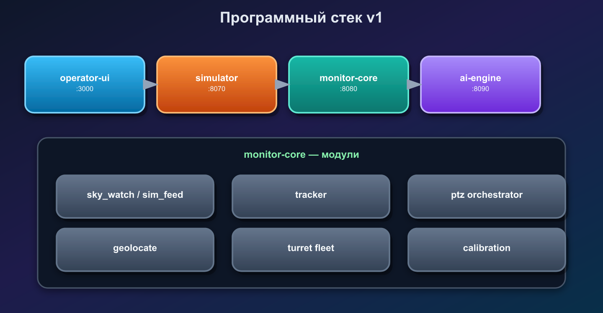
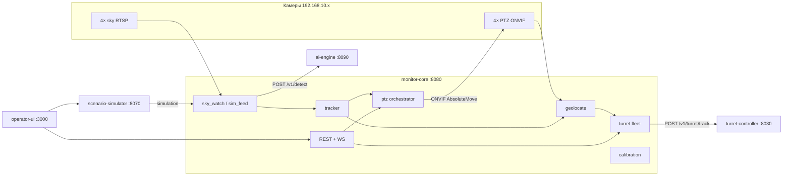

# Программная архитектура v0.1

Код следует [architecture.md](architecture.md). Заводское оборудование (Hikvision RTSP/ONVIF); кастомный только модуль турели.

## Сервисы

## Поток данных

1. **sky_watch** — substream каждой sky-камеры, 1–2 FPS → **ai-engine** `/v1/detect`.
2. **tracker** — bbox → грубый az/el по FOV и `sector_az_deg` / `mount_tilt_deg`.
3. **ptz orchestrator** — 2 ближайших PTZ по `base_az_deg` → ONVIF cue.
4. **geolocate** — пересечение 2 лучей (v1: упрощённая триангуляция в ENU).
5. **turret fleet** — для каждой цели выбирается одна турель из `bound_turrets` (дальность, сектор, priority).

Турель может стоять **отдельно** от купола/куба; на площадке может быть **несколько** модулей с общим `site_id`.

Выстрел **не** инициируется core — только `track` / `arm` / `safe` ([turret.md](turret.md) §8.2).

## Конфигурация

| Файл | Назначение |
|------|------------|
| `config/site.yaml` | `deployment.type`, камеры, origin, `offset_en_m` |
| `config/site.example.yaml` | cube_compact |
| `config/site.building.example.yaml` | building_corners |
| `config/turret.yaml` | одна турель (legacy / куб) |
| `config/turrets/*.yaml` | несколько турелей |
| `site.yaml` → `bound_turrets` | реестр модулей |
| `.env` | пароли ONVIF, URL ai-engine, `DRY_RUN` |

## Заглушки и sim

| Компонент | Состояние |
|-----------|-----------|
| `services/ai` | API готов; ONNX — позже |
| `ingest/rtsp.py` | метаданные кадра; OpenCV — при подключении железа |
| `services/turret-sim` | эмуляция firmware для отладки (`docker compose --profile sim`) |
| `services/simulator` | сценарии и feed детекций (`docker compose --profile ui`) |
| `services/operator-ui` | веб-консоль оператора |

## Следующие шаги

- RTSP decode (OpenCV/ffmpeg) + JPEG в ai-engine
- Классификация на PTZ crop → обновление `class`/`confidence`
- Kalman по трекам, merge overlap между sky
- PTZ GetStatus в geolocate (вместо cue az/el)
- Heartbeat core → турель, SAFE при потере связи
- Процедура калибровки на полигоне → `calibrated_at` в `aim_calibration`
