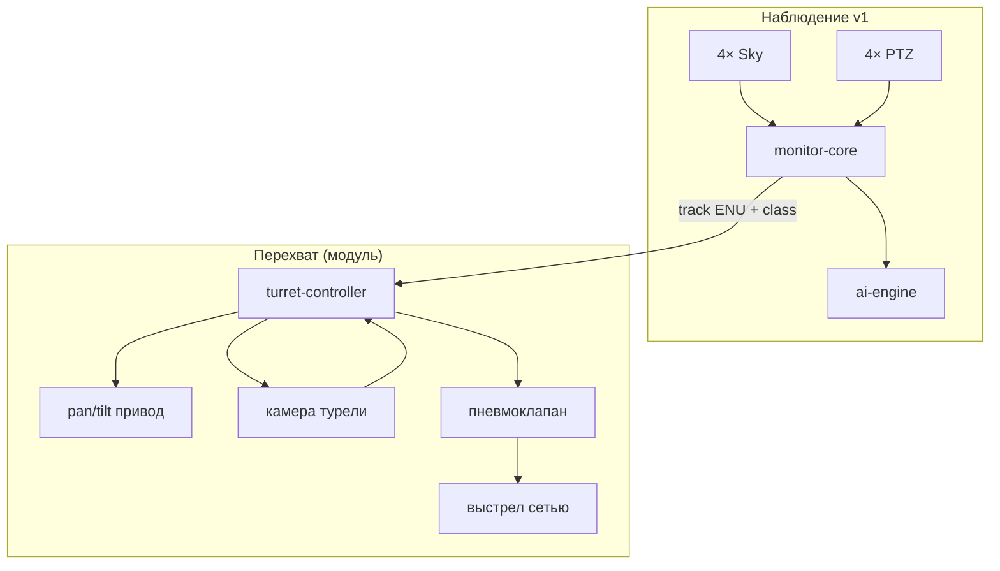
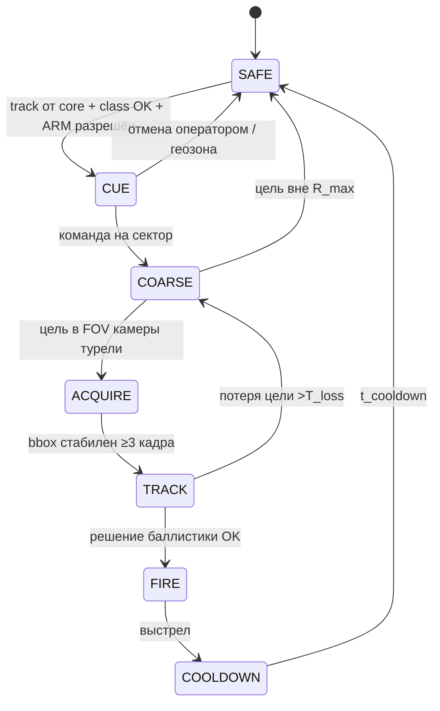

# Исполнительное устройство — турель с пневмосетью

Версия: **0.1 (проект)**  
Дата: 2026-07-08  
Статус: **опциональный модуль** (не в базовом v1 наблюдения)

---

## 1. Назначение

Турель **перехватывает** воздушную цель в зоне до **50 m** наклонной дальности:

1. Получает от **monitor-core** грубые координаты и скорость цели (из Sky + PTZ + geolocate).
2. **Наводится** на сектор цели, пока цель не попадёт в поле зрения **локальной камеры** турели.
3. В зоне поражения ведёт цель с **упреждением** по траектории и скорости.
4. Выпускает **пневматический снаряд-сеть**, раскрывающуюся в полёте; **центр раскрытия** должен совпасть с прогнозируемой позицией цели.

| Параметр | Значение |
|----------|----------|
| R_max (перехват) | **50 m** |
| R_min (безопасный выстрел) | **8–12 m** (после раскрытия сети) |
| Скорость наведения (грубо) | до сектора по данным core |
| Скорость сопровождения | 30–50 Hz локальный контур |
| Боеприпас | одноразовый патрон «сеть» |

> **Правовой аспект:** применение сетевых систем перехвата регулируется законодательством. Документ описывает **техническую** архитектуру; перед эксплуатацией — согласование с юристом и регулятором.

---

## 2. Место в комплексе



| Источник | Данные для турели |
|----------|-------------------|
| monitor-core | `target_id`, позиция ENU `(x,y,z)`, скорость `(vx,vy,vz)`, класс, `confidence` |
| Камера турели | Локальный bbox, угловые скорости, подтверждение в FOV |
| turret-controller | Решение на выстрел, телеметрия, SAFE |

Турель **не заменяет** PTZ наблюдения: комплекс обнаруживает и даёт геометрию; турель — **точное наведение и выстрел** в ближней зоне.

### 2.1 Автономное развёртывание

Турель — **отдельный физический модуль**: может стоять в **2–20 m** от купола-hub или куба (или на другом постаменте на той же площадке). Собственные:

- контроллер (`192.168.10.30`),
- камера (`192.168.10.31`),
- пневмоблок и приводы.

| Режим | Описание |
|-------|----------|
| **Связанный** | monitor-core шлёт треки в site ENU; турель ведёт грубый + точный контур |
| **Автономный** | Только локальная камера турели (ACQUIRE…TRACK); без комплекса наблюдения |
| **Связанный + автономный** | Трек от core ускоряет CUE; при потере связи — локальный контур или SAFE |

Даже в автономном режиме в `config/turret.yaml` должна быть **привязка к площадке** (`site_binding`) — общий origin и `site_id` с `config/site.yaml`.

### 2.2 Привязка к monitor-core

Обе стороны используют **одну систему координат** — site ENU (origin = опорная точка площадки: **центр купола** или **центр куба**):

| Параметр | Где | Назначение |
|----------|-----|------------|
| `site.name` | `site.yaml` | Идентификатор площадки |
| `site_binding.site_id` | `turret.yaml` | **Должен совпадать** с `site.name` |
| `origin_lat/lon/alt_m` | оба файла | WGS84 origin (копия или уточнение после съёмки) |
| `offset_enu_m` | `turret.yaml` | Положение оси pan/tilt от origin `[E, N, U]` м |
| `base_az_deg` | `turret.yaml` | Нуль pan → истинный север |

При старте monitor-core отправляет **`POST /v1/turret/bind`** на контроллер. Турель отклоняет треки с чужим `site_id` или без предварительного bind (если `site_binding.required: true`).

В `site.yaml` список `bound_turrets` — реестр **одной или нескольких** турелей на площадке (см. §2.4).

### 2.4 Несколько турелей

На одной площадке может быть **2+ модуля** с разными постаментами и секторами обстрела.

| Параметр | Назначение |
|----------|------------|
| `bound_turrets[]` в `site.yaml` | Реестр: `id`, путь к `config/turrets/*.yaml`, `enabled` |
| `offset_enu_m` | Положение **каждой** турели от общего origin |
| `safety.sector_az_*` | Сектор ответственности (азимут от постамента) |
| `turret.priority` | При равной дальности — выше число = предпочтительнее |

**Назначение цели (monitor-core):**

1. Фильтр: класс, confidence, дальность от **постамента** (`range_min`…`range_max`), сектор az.
2. Если подходят несколько — **ближайшая** к цели турель (sticky на `target_id`, пока цель в зоне).
3. На одну цель трек уходит **только на один** контроллер (исключение двойного FIRE).

Пример сети:

| IP | Устройство |
|----|------------|
| .30 | turret-01 controller |
| .31 | turret-01 camera |
| .32 | turret-02 controller |
| .33 | turret-02 camera |

Конфиги: [turret-01.example.yaml](../config/turrets/turret-01.example.yaml), [turret-02.example.yaml](../config/turrets/turret-02.example.yaml).

### 2.3 Калибровка наведения

Калибровка связывает **энкодеры pan/tilt**, **оптическую ось камеры** и **ось ствола** с site ENU.

| Этап | Параметр | Процедура |
|------|----------|-----------|
| 1. Нуль pan | `pan_zero_offset_deg` | Pan на метку севера / GPS-курс; сравнение с `base_az_deg` |
| 2. Нуль tilt | `tilt_zero_offset_deg` | Tilt на горизонт (эталонный уровень / дальний ориентир) |
| 3. Bore-sight | `bore_offset_az/el_deg` | Лазер/коллиматор: камера на мишени → измерить отклонение ствола |
| 4. Поправка по el | `az_correction[]` | Несколько углов места (30°, 45°, 60°) — компенсация люфта |
| 5. Фиксация | `calibrated_at`, `calibrated_by` | Запись после полигона |

**Грубое наведение (core):** `position_enu_m` в site ENU → вектор от `offset_enu_m` → `cue_az_deg`, `cue_el_deg` с поправками.

**Точное наведение (firmware):** локальный bbox 30–50 Hz + упреждение; для FIRE добавляется `bore_offset_*`.

До завершения калибровки (`calibrated_at: null`) турель может принимать треки, но **FIRE заблокирован** прошивкой.

### Схемы

| Файл | Содержание |
|------|------------|
| [turret-overview.png](images/turret-overview.png) | Блок-схема и зоны |
| [turret-engagement.png](images/turret-engagement.png) | Фазы наведения |

---

## 3. Физическая компоновка

```text
                    цель ✈
                      ╲
                       ╲  R ≤ 50 m
                        ╲
    [комплекс наблюдения]     ●━━━━━━► траектория с упреждением
         ▲               │
         │               ▼
    Sky + PTZ      ┌─────────────┐
                   │  ТУРЕЛЬ     │
                   │  [камера]   │── ось прицеливания
                   │  [ствол]    │── пневмосеть
                   └──────┬──────┘
                          │ постамент
                       ═══╧═══  земля
```

| Узел | Описание |
|------|----------|
| Постамент | Жёсткая плита / фундамент, привязка к GPS площадки |
| Pan / Tilt | 2 оси: az **360°**, el **−5°…+85°** (на небо) |
| Ствол | Жёстко на tilt-раме, параллельно оптической оси камеры (после калибровки) |
| Камера | Коаксиально или с фиксированным `bore_offset` |
| Пневмоблок | Ресивер / компрессор, клапан, датчик P |

Рекомендуемое размещение: **центр площадки** (у купола) или смещение **2–5 m**, чтобы зона 50 m перекрывала подходы.

---

## 4. Режимы работы (конечный автомат)



| Состояние | Действие |
|-----------|----------|
| **SAFE** | Ствол в парковке, клапан закрыт, давление контролируется |
| **CUE** | Принят трек от core; проверка класса (напр. только `drone`) |
| **COARSE** | Pan/tilt на `az_el` от geolocate; скорость slew **макс.** |
| **ACQUIRE** | Поиск blob/детектор на камере турели |
| **TRACK** | Калман по углам + дальности (от core или стерео/лазер опц.) |
| **FIRE** | Импульс клапана, лог события |
| **COOLDOWN** | Перезарядка патрона вручную; пауза **≥5 s** |

---

## 5. Двухконтурное наведение

### 5.1 Грубый контур (от monitor-core)

- Вход: `az`, `el`, `range` из триангуляции PTZ (обновление 2–10 Hz).
- Задача: повернуть турель так, чтобы цель попала в **FOV локальной камеры** (напр. HFOV 20–40°).
- Критерий перехода в ACQUIRE: `|Δaz| < 0.5°` и `|Δel| < 0.5°` **или** детекция в кадре.

### 5.2 Точный контур (камера турели)

| Параметр | Ориентир |
|----------|----------|
| Камера | Bullet 1080p–4MP, **30–60 FPS**, HFOV **25–35°** |
| Задержка контура | **≤30 ms** (железо + прошивка) |
| Фильтр | Kalman: состояние `(az, el, ẋaz, ẋel)` или ENU при известной R |

Упреждение линии визирования:

```
az_fire = az_target + ω_az × t_go
el_fire = el_target + ω_el × t_go

t_go = t_flight + t_open + t_latency
```

где:
- `t_flight` — время полёта снаряда до дальности R;
- `t_open` — задержка полного раскрытия сети после вылета;
- `t_latency` — суммарная задержка сенсор → решение → клапан.

---

## 6. Баллистика сети (кратко)

Подробно: [turret-ballistics.md](turret-ballistics.md).

| Параметр | Проектное значение | Примечание |
|----------|-------------------|------------|
| v₀ (начальная скорость) | **28–35 m/s** | Зависит от давления и массы патрона |
| R_max | **50 m** | Верхняя граница зоны |
| Диаметр сети раскрытой D_net | **3–5 m** | На R_max; калибровка на полигоне |
| t_open | **0.15–0.35 s** | От вылета до ≥90% площади сети |
| Угол возвышения | из TRACK | Учёт `z` цели |

Условие попадания (центр сети в цель):

```
‖ p_target(t_fire + t_go) − p_net_center(t_fire + t_go) ‖ < R_kill

R_kill ≈ D_net / 2 − r_target
```

Для дрона 0.5 m: нужен **D_net ≥ 2–3 m** на дальности выстрела.

---

## 7. Пневматика

```text
[компрессор] или [HPA баллон 200–300 bar]
        │
   [редуктор 8–12 bar]
        │
   [ресивер 0.5–2 L]
        │
   [датчик P] ── interlock
        │
 [быстродейств. соленоид] ──► [патрон сети] ──► ствол
```

| Компонент | Спецификация |
|-----------|--------------|
| Рабочее давление | **8–12 bar** (уточняется патроном) |
| Клапан | 12 V DC, время открытия **<10 ms** |
| Ресивер | Стабилизация P при выстреле |
| Interlock | Выстрел только при `P ∈ [P_min, P_max]` и `SAFE=false` |

Перезарядка: **ручная** замена одноразового патрона (v0.1).

---

## 8. Электроника и ПО

### 8.1 Архитектура

| Узел | Железо | Роль |
|------|--------|------|
| **turret-controller** | STM32H7 / ESP32-S3 + драйверы шаговиков | Real-time: PID pan/tilt, клапан, SAFE |
| **turret-agent** (опц.) | Linux SBC на турели или в core | RTSP камеры, локальный `/detect` |
| Связь с core | Ethernet **192.168.10.30**, UDP/REST | Команды, телеметрия 50 Hz |

### 8.2 API (monitor-core → турель)

```
POST /v1/turret/bind
{
  "turret_id": "turret-01",
  "site_id": "cube-01",
  "origin_lat": 55.75, "origin_lon": 37.62, "origin_alt_m": 200.0,
  "magnetic_declination_deg": 11.0,
  "offset_enu_m": [2.0, 0.0, 0.0],
  "base_az_deg": 0.0,
  "aim_calibration": { "pan_zero_offset_deg": 0.1, ... }
}
→ { "ok": true }

POST /v1/turret/track
{
  "target_id": "trk-42",
  "site_id": "cube-01",
  "frame": "site_enu",
  "class": "drone",
  "confidence": 0.91,
  "position_enu_m": [12.3, 45.0, 8.2],
  "velocity_enu_m_s": [-2.1, 4.5, 0.3],
  "valid_until_ms": 1730000000000,
  "cue_az_deg": 15.2,
  "cue_el_deg": 32.1
}

GET  /v1/turrets
→ [{ id, enabled, offset_enu_m, binding_ok, sector_az_deg, ... }]

GET  /v1/turrets/{id}/status
POST /v1/turrets/{id}/arm
POST /v1/turrets/{id}/safe

# агрегированные (все модули):
POST /v1/turret/arm
POST /v1/turret/safe
GET  /v1/turret/binding   → массив по всем турелям
```

Выстрел инициирует **только turret-controller** локально, когда TRACK + баллистика OK (не по команде «огонь» с сервера без двойного подтверждения).

### 8.3 Безопасность

| Мера | Описание |
|------|----------|
| Двухэтапное взведение | ARM на сервере + физический ключ/кнопка на посту |
| Геозона | Не стрелять ниже `el_min` (земля/люди) и вне сектора |
| Класс цели | FIRE только при `class ∈ {drone}` и `confidence > порог` |
| Rate limit | Не более 1 выстрела / 30 s |
| SAFE при потере связи | Потеря heartbeat core >500 ms → SAFE |
| Запись | Камера турели + логи → recorder |

---

## 9. BOM (ориентир)

| Позиция | Qty | ~₽ | Примечание |
|---------|-----|-----|------------|
| Pan/tilt привод (шаговики + редуктор + AS5600) | 1 | 25–40k | Люфт <0.2° |
| Пневмопушка / патрон сети | 1 | 30–80k | Подбор с поставщиком СБ |
| Компрессор / HPA + редуктор | 1 | 15–40k | |
| Камера bullet 4MP 30fps | 1 | 8–14k | Локальный RTSP |
| Контроллер STM32 + плата силовая | 1 | 8–15k | |
| Постамент, кожух IP54 | 1 | 20–40k | |
| **Итого модуль** | | **~110–230k** | без НИОКР полигона |

Сеть: порт switch **.30** контроллер, **.31** камера турели.

---

## 10. Этапы внедрения

| Этап | Содержание |
|------|------------|
| 1 | Макет pan/tilt + камера, slew по UDP от core |
| 2 | Локальный TRACK 30 FPS, запись без выстрела |
| 3 | Полигон: калибровка `v₀`, `t_open`, `D_net(R)` |
| 4 | Пневматика + холостые выстрелы |
| 5 | Перехват мишеней (не БПЛА) → мягкие цели |
| 6 | Интеграция с классификатором core |

---

## 11. Связанные документы

- [turret-ballistics.md](turret-ballistics.md) — расчёт упреждения и зон
- [config/turret.example.yaml](../config/turret.example.yaml)
- [firmware/turret-controller/README.md](../firmware/turret-controller/README.md)
- [architecture.md](architecture.md) §10
